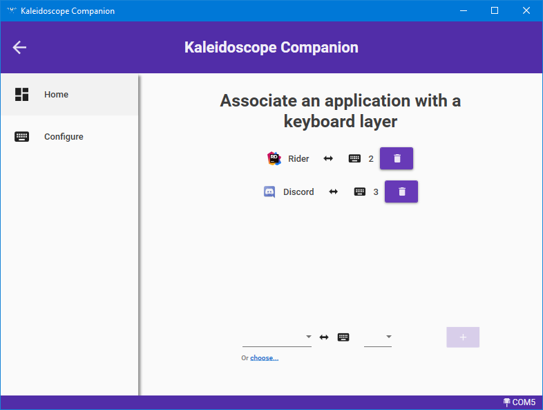

# Kaleidoscope-WindowsIntegration-Client (a.k.a Kaleidoscope Companion)

Windows application for integration with [Keyboard.io](https://keyboard.io) model 01 with the OS.

*At the moment, the only feature is the on-the-fly layer switching depending on the focused window*

It uses [Kaleidoscope-WindowsIntegration](https://github.com/Nimamoh/Kaleidoscope-WindowsIntegration) to communicate with the keyboard. Don't forget to install it on your keyboard.

## How to install

Go to [releases](https://github.com/Nimamoh/Kaleidoscope-WindowsIntegration-Client/releases). Grab the last zip and run setup.exe.

## How to start application with the system

- Type <kbd>WIN</kbd>+<kbd>R</kbd> then type `shell:startup`
- On the opened folder, right click and choose `New > Create shortcut` then choose the application executable.

Now, the application should start on login

## How to use

The usage is very straightforward. Connect to your keyboard choosing the correct serial port. Then you have this screen:

Use the bottom menu to choose an application and a keyboard layer. 
As long as the application is running, it will apply the configured layers depending on your focused application.

You can configure several layers for a same application. Although it will deactivate layers on window unfocus. I recommand defining keyboard layers specifically to be used with this application. 
